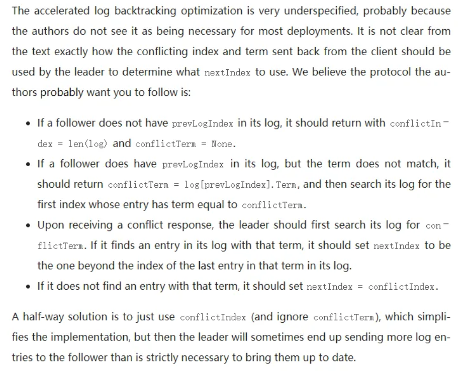
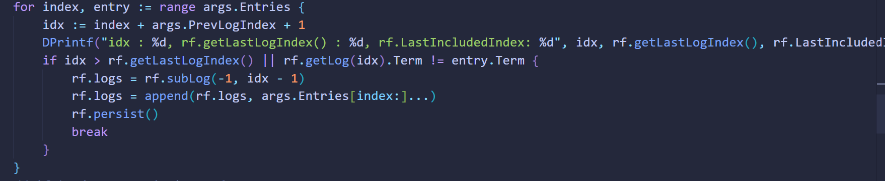

之前是 - 1，这必然导致效率过慢，这是助教所提到的优化方式



考虑下面的情况，s2提交到了10，并且log追加到了12，还没来的及复制到其他节点，此时s2出现网络故障，s1超时进行选举（0 1 3），成为leader，term=5，并追加了两条log，还没来的及复制到其他节点，这个时候s1也出现网络故障，s3超时进行选举成为leader（0 3），并追加了三条log，恰巧此时s1 s2 恢复正常


| Peer\\ index | 9 | 10 | 11 | 12 | 13 |
| ------------ | - | -- | -- | -- | -- |
| s0           | 3 | 4  |    |    |    |
| s1           | 3 | 4  | 5  | 5  |    |
| s2           | 3 | 4  | 4  | 4  |    |
| s3           | 3 | 4  | 6  | 6  | 6  |

```go
prevLogIndex = 12
prevLogTerm = 6
```

**1.使用conflictIndex 和 conflictTerm （文中提到的）**

此两者 **conflictTerm 为 log[**prevLogIndex**].Term, conflictIndex为conflictTerm在该日志对应的第一条日志索引**

**follower端**

**s0 ：因为prevlogindex超出了s0的整个日志长度，所以conflictIndex = getlastlogindex + 1 = 11， conflictTerm = none**

**s1：conflictTerm = 5， 对应的第一个索引 conflictIndex = 11**

**s2：conflictTerm = 4， 对应的第一个索引 conflictIndex = 10**

**leader端 （先检查conflictTerm，如果找到了，设置nextindex为超过这个conflicterm的第一个index，如果没有，直接设置为conflictIndex）**

s0 ： 无**conflictTerm， nextindex0 = 11，prelogindex = 10**

s1 ： 找不到**conflictTerm， nextindex1 = 11**

s2 ： 找到了**conflictTerm，在leader里对应的index = 10， 因此nextindex2 = 11**

**2.只使用conflictIndex （文中提到的 half-way solution，也是我使用的）**

**follower端 （找到发生冲突term对应的第一个index）**

**s0 ：因为prevlogindex超出了s0的整个日志长度，所以conflictIndex = getlastlogindex + 1 = 11，**

**s1：冲突Term = 5， 对应的第一个索引 conflictIndex = 11**

**s2：冲突Term = 4， 对应的第一个索引 conflictIndex = 10**

**leader端 （直接将nextindex设置为conflictIndex）**

s0 ：  **nextindex0 = 11**

s1 ：  **nextindex1 = 11**

s2 ：**nextindex2 = 10 ，prelogindex = 9（相比第一种方案会多发送一个）**

一. 对应的我就有个问题了。`raft`并不能修改已经 `commit` 的 `log`，这两种方案如何保证，如果s2已经提交了index  = 10的log呢。对于第一种方案，确实不会去修改已经commit的log。但是第二种方案，这里的日志并未冲突，却有可能被截断，我们如何考虑这个问题?

二. 再想象一种情景

```1.leader先发出append
1.leader先发出append entry RPC1

2.发出append entry RPC2

3.此时可能因为网络原因RPC2先到达，比如此时log更新到778

4.RPC1到达，如果只是直接更新log，可能会导致截断log使其更短，比方777

但是conmmit有可能已经更新到了778，这个时候如果截断了，会导致log为nil,commit会发生错误
```

会发现，未发生冲突的日志我们其实无需更改

因此在截断log部分，不能无脑直接prevlogindex后面全部截取，而应该从冲突的地方开始截取，这种截取日志的方案很好的解决了上面两个问题。

